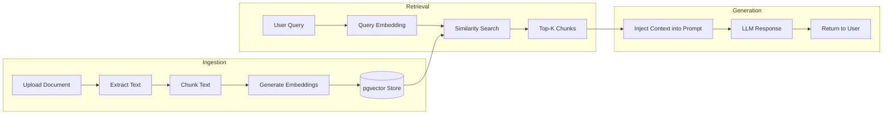

# RAG Pipeline

## Overview

GenAI Auto uses **Retrieval-Augmented Generation (RAG)** to answer questions from technical documentation. The Specs Agent searches a vector knowledge base of vehicle manuals, specifications, and guides to provide accurate, source-grounded responses.

---

## Architecture



---

## Components

### 1. Document Ingestion (`src/rag/pipeline.py`)

Orchestrates the full ingestion flow: load, chunk, embed, store.

**Supported Formats**:

| Format | Extension | Library |
|--------|-----------|---------|
| PDF | `.pdf` | pypdf |
| Word | `.docx` | python-docx |
| Text | `.txt` | built-in |
| Markdown | `.md` | built-in |

**Document Types**:

| Type | Description | Example |
|------|-------------|---------|
| `manual` | Owner manuals | GenAuto X1 2024 Manual |
| `spec` | Technical specifications | Engine specs, dimensions |
| `guide` | Feature guides | Infotainment, ACC, parking assist |
| `faq` | Frequently asked questions | Common customer questions |
| `troubleshoot` | Diagnostic guides | Common problems and solutions |

### 2. Text Chunking (`src/rag/chunker.py`)

Splits documents into searchable chunks with configurable strategies.

| Strategy | Description | Best For |
|----------|-------------|----------|
| `recursive` (default) | Splits on `\n\n`, `\n`, `. `, ` ` respecting boundaries | General documents |
| `semantic` | Paragraph-based, maintains semantic coherence | Long-form text |
| `markdown` | Respects header hierarchy (`#`, `##`, `###`) | Markdown files |
| `fixed` | Simple fixed-size chunks | Uniform content |

**Default Configuration**:
- **Chunk size**: 1000 characters
- **Overlap**: 200 characters
- **Separators**: `["\n\n", "\n", ". ", " ", ""]`
- **Auto-detection**: Automatically selects strategy based on file extension

### 3. Embedding Generation (`src/rag/embeddings.py`)

Generates vector embeddings for document chunks.

**Configuration**:

| Setting | Default | Description |
|---------|---------|-------------|
| `EMBEDDING_MODEL` | `nomic-ai/nomic-embed-text-v1.5` | Model identifier |
| `EMBEDDING_DIMENSION` | `768` | Vector dimensions (must match model) |

**Features**:
- **Batch processing**: 100 texts per API call
- **Text cleaning**: Removes excessive whitespace, truncates to 8000 chars
- **Caching**: Redis-backed via `CachedEmbeddingService` (24h TTL)

**Cache Key Format**: `genai:embedding:{model}:{text_hash}`

### 4. Vector Storage (`src/rag/vectorstore.py`)

Stores and searches embeddings using PostgreSQL + pgvector.

**Similarity Metric**: Cosine distance (`<=>` operator)

```sql
-- Similarity search query
SELECT content, source, document_type,
       1 - (embedding <=> CAST(:query AS vector)) AS similarity
FROM document_embeddings
WHERE document_type = :type  -- optional filter
ORDER BY embedding <=> CAST(:query AS vector)
LIMIT :top_k;
```

**Operations**: add, search, delete, list, stats

### 5. Retrieval (`src/rag/retriever.py`)

Retrieves relevant chunks for a user query.

**Parameters**:
- `top_k`: Number of results (default: 5, configurable via `SIMILARITY_TOP_K`)
- `max_tokens`: Maximum context tokens (default: 3000)
- Filters: `document_type`, `source`, `min_score`

---

## Usage

### Upload a Document

```bash
curl -X POST http://localhost:8000/api/v1/documents/upload \
  -H "Authorization: Bearer <token>" \
  -F "file=@vehicle_manual.pdf" \
  -F "document_type=manual"
```

### Ingest Text Directly

```bash
curl -X POST http://localhost:8000/api/v1/documents/ingest-text \
  -H "Authorization: Bearer <token>" \
  -H "Content-Type: application/json" \
  -d '{
    "text": "The GenAuto X1 2024 has a 1.5L turbocharged engine producing 150 HP...",
    "source": "genautox1_specs",
    "document_type": "spec"
  }'
```

### Search the Knowledge Base

```bash
curl -X POST http://localhost:8000/api/v1/documents/search \
  -H "Content-Type: application/json" \
  -d '{"query": "engine power specifications", "top_k": 5}'
```

### Seed Sample Data

```bash
docker-compose exec api python scripts/seed_knowledge_base.py
```

This ingests 6 documents covering GenAuto X1 2024: specs, maintenance guide, troubleshooting guide, features guide, FAQ, and safety manual.

### View Knowledge Base Stats

```bash
curl http://localhost:8000/api/v1/documents/stats
```

---

## Performance Optimization

### Embedding Cache

Redis caches generated embeddings to avoid redundant API calls:
- **TTL**: 24 hours
- **Key**: `genai:embedding:{model}:{sha256(text)}`
- **Hit rate**: Tracked via Prometheus (`cache_operations_total`)

### Batch Processing

Embedding generation processes up to 100 texts per API call, reducing latency for bulk ingestion.

### Connection Pooling

PostgreSQL connection pool (size 10, overflow 20) ensures efficient database access under load.

---

## Metrics

RAG-specific metrics tracked via Prometheus (see [Advanced Metrics](ADVANCED_METRICS.md)):

| Metric | Description |
|--------|-------------|
| `rag_similarity_score` | Cosine similarity of retrieved chunks |
| `rag_documents_retrieved_total` | Total documents retrieved |
| `rag_search_latency_ms` | Vector search latency |
| `cache_operations_total{cache_type="embedding"}` | Embedding cache hit/miss |

---

## Troubleshooting

### Vector Dimension Mismatch

```
Error: expected 768 dimensions, not 1536
```

**Cause**: Embedding model output doesn't match database column size.

**Fix**: Either change the model or alter the column:
```sql
ALTER TABLE document_embeddings ALTER COLUMN embedding TYPE vector(1536);
```

### Empty Search Results

**Causes**:
1. Knowledge base not seeded - run `scripts/seed_knowledge_base.py`
2. Query too different from stored content
3. Wrong `document_type` filter

### Embedding API Errors

```
Error: Model does not exist
```

**Fix**: Verify `EMBEDDING_MODEL` in `.env` matches an available model on OpenRouter.

---

## Source Files

- Pipeline orchestrator: `src/rag/pipeline.py`
- Text chunking: `src/rag/chunker.py`
- Embedding service: `src/rag/embeddings.py`
- Vector store: `src/rag/vectorstore.py`
- Retriever: `src/rag/retriever.py`
- Seed script: `scripts/seed_knowledge_base.py`
