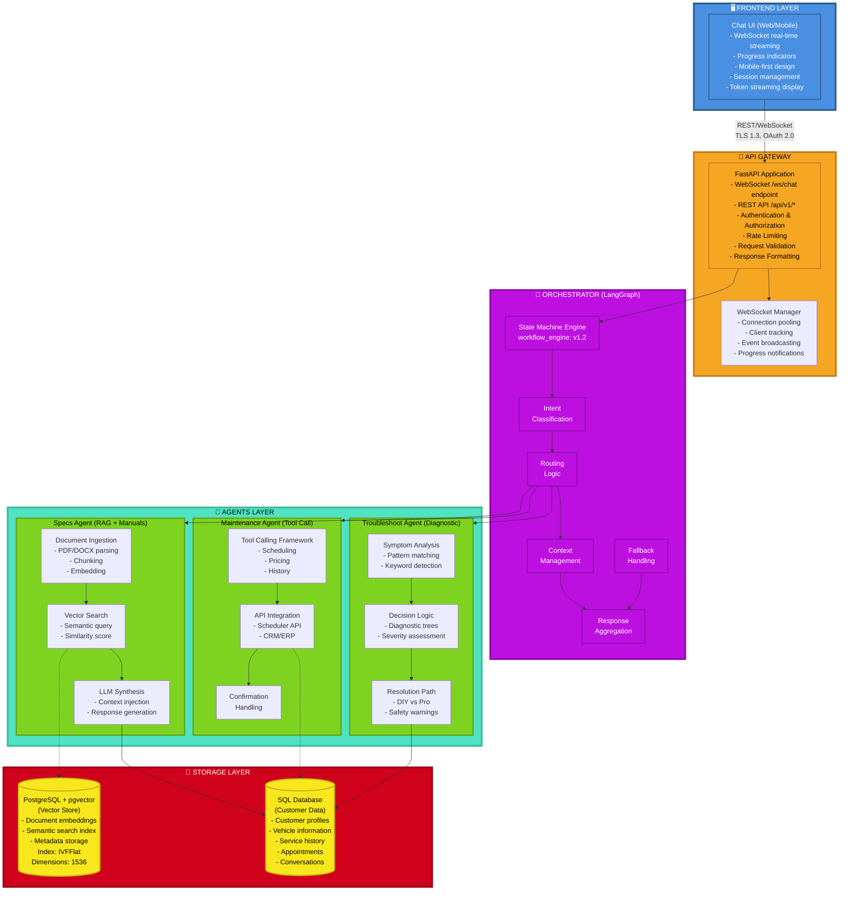

# GenAI Auto - Architecture Documentation

## Overview

GenAI Auto is a multi-agent AI system designed for automotive customer service. It uses LangGraph for orchestration and LangChain for agent implementation.

## System Architecture



## Data Flow

### WebSocket Chat Flow (Real-Time)

**Connection Establishment:**
1. Client connects to `ws://localhost:8000/ws/chat`
2. Server accepts and assigns unique client ID
3. Connection stored in active connections pool

**Message Processing:**
1. **User Input** → Client sends JSON message via WebSocket
   ```json
   {
     "type": "message",
     "message": "What are the specs of Honda Civic 2024?",
     "session_id": "session-123"
   }
   ```

2. **Progress Updates** → Server sends real-time progress events
   - `{"type": "progress", "step": "starting", "message": "Processing..."}`
   - `{"type": "progress", "step": "agent_routing", "message": "Routing to expert..."}`
   - `{"type": "progress", "step": "rag_retrieval", "message": "Searching knowledge base..."}`

3. **Orchestrator** → LangGraph workflow processes request
   - Classifies intent (SPECS/MAINTENANCE/TROUBLESHOOT)
   - Routes to appropriate agent
   - Agent executes (RAG search, tool calls, diagnostics)
   - Generates response using LLM

4. **Response Delivery** → Complete response sent to client
   ```json
   {
     "type": "complete",
     "response": "The 2024 Honda Civic features...",
     "session_id": "session-123",
     "metadata": {
       "agent": "specs",
       "confidence": 0.95,
       "context": {}
     }
   }
   ```

**Key Implementation Details:**
- Uses `workflow.ainvoke()` for complete final state (not `astream()` partial chunks)
- Async processing throughout the entire pipeline
- Connection manager tracks all active WebSocket clients
- Error handling with graceful degradation

### REST Chat Request Flow (Legacy)

1. **User Input** → Frontend captures user message
2. **API Gateway** → Validates, authenticates, rate limits
3. **Orchestrator** → Classifies intent, routes to agent
4. **Agent Processing** → Retrieves context, generates response
5. **Storage** → Logs conversation, updates state
6. **Response** → Returns JSON response

### Document Ingestion Flow

1. **Upload** → Document received via API
2. **Extraction** → Text extracted from PDF/DOCX
3. **Chunking** → Split into 1000-char chunks with overlap
4. **Embedding** → Generate OpenAI embeddings
5. **Storage** → Store in pgvector with metadata

## Agent Details

### Specs Agent (RAG + Manuals)
- Uses RAG (Retrieval Augmented Generation)
- Searches technical documentation
- Synthesizes answers from multiple sources

### Maintenance Agent (Tool Call → Scheduler)
- Implements LangChain tools for scheduling
- Integrates with external scheduler API
- Manages appointments and history

### Troubleshoot Agent (Diagnostic Tree)
- Uses decision trees for common issues
- Assesses severity and safety concerns
- Guides users through diagnostic steps

## Security

- TLS 1.3 for all communications
- OAuth 2.0 authentication
- Rate limiting per user/IP
- Input validation and sanitization
- Secure secrets management

## Scalability

- Stateless API design
- Connection pooling for database
- Horizontal scaling with container orchestration
- Async processing throughout
- WebSocket connection pooling for real-time chat

## WebSocket Protocol Specification

### Endpoint
- **URL**: `ws://localhost:8000/ws/chat`
- **Protocol**: WebSocket (RFC 6455)
- **Authentication**: None (PoC mode) - can be added via query params or initial message

### Client → Server Messages

**Chat Message:**
```json
{
  "type": "message",
  "message": "Your question here",
  "session_id": "optional-session-id",
  "customer_id": "optional-customer-id"
}
```

### Server → Client Messages

**Progress Update:**
```json
{
  "type": "progress",
  "step": "starting" | "agent_routing" | "rag_retrieval" | "generating",
  "message": "Human-readable progress message"
}
```

**Streaming Token (deprecated, not currently used):**
```json
{
  "type": "token",
  "token": "word or phrase",
  "partial_response": "accumulated response so far"
}
```

**Complete Response:**
```json
{
  "type": "complete",
  "response": "Full response text",
  "session_id": "session-id",
  "metadata": {
    "agent": "specs" | "maintenance" | "troubleshoot",
    "confidence": 0.95,
    "context": {}
  }
}
```

**Error:**
```json
{
  "type": "error",
  "error": "Error message",
  "code": "ERROR_CODE"
}
```

### Connection Management

**ConnectionManager Class:**
- Tracks active connections by client ID
- Provides methods: `connect()`, `disconnect()`, `send_json()`, `send_text()`
- Singleton pattern for global state management

**Client ID Generation:**
- Format: `ws_{timestamp}`
- Example: `ws_1707489123.456`

### Error Handling

- Empty message → `EMPTY_MESSAGE` error code
- Processing errors → `PROCESSING_ERROR` with exception details
- Connection errors → automatic reconnection on client side
- Graceful degradation with informative error messages
